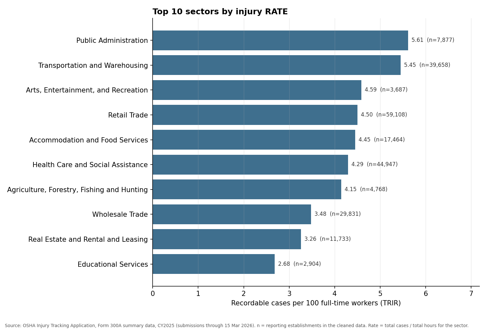
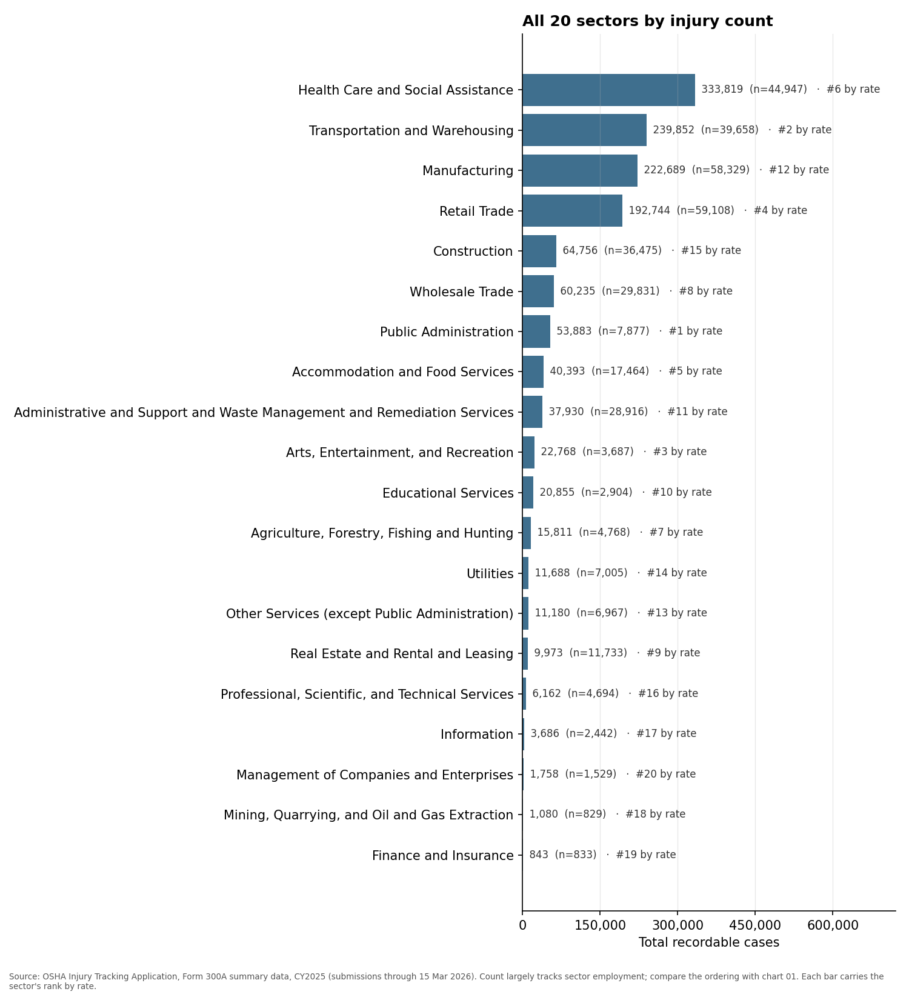
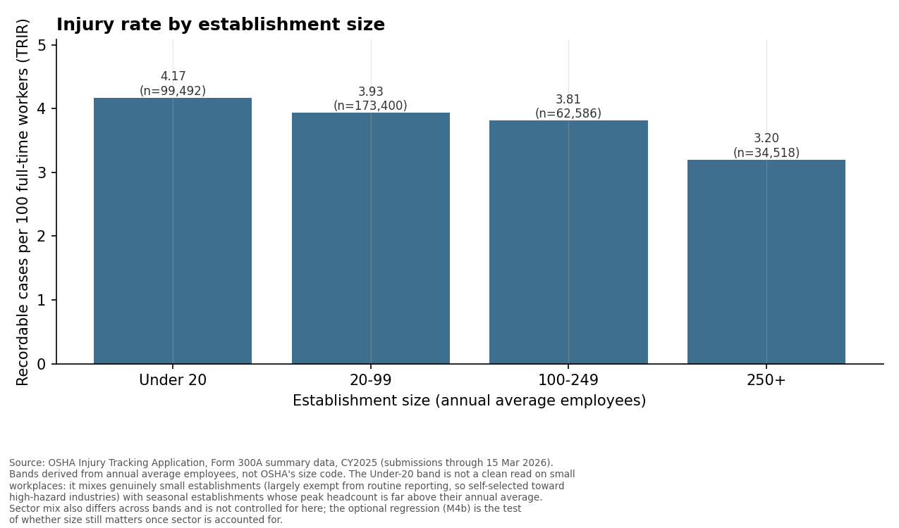
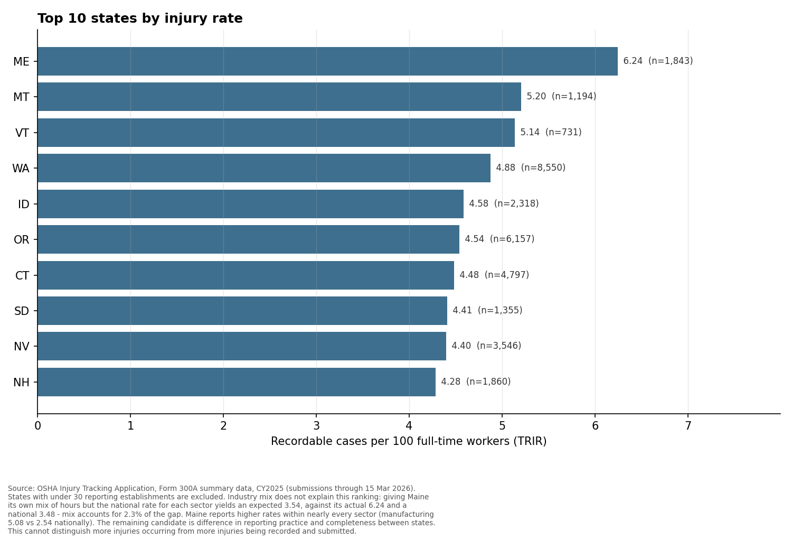

# Leading Indicator — which US workplaces actually have the highest injury rates

> **[ASHVI WRITES THIS]** — the opening finding sentence.
> One sentence, in your own words, stating the finding with numbers. It should say that
> ranking sectors by hours-normalised rate rather than raw case count reorders the top five,
> and name the sharpest example. Everything below is evidence for that sentence.

Analysis of **369,996 US establishment records** from OSHA's Injury Tracking Application,
Form 300A summary data for calendar year 2025 (submissions received through 15 March 2026).
DuckDB + SQL for cleaning and aggregation, Python for charts and one regression, Excel for the
pivot dashboard.

The metric throughout is **TRIR — recordable cases per 100 full-time workers**:

```
TRIR = recordable cases x 200,000 / total hours worked
```

200,000 hours is 100 employees x 40 hours x 50 weeks. Every aggregate rate in this project is
`SUM(cases) * 200,000 / SUM(hours)` — cases summed, hours summed, divided once. Never an
average of per-establishment rates, which would weight a 10-person shop the same as a
5,000-person plant.

---

## 1. Ranking by rate instead of count reorders the top five

Raw injury counts mostly track how many people a sector employs. Normalising by hours worked
changes the answer: **three of the top five sectors are replaced.**

| sector | rank by count | rank by rate | recordable cases | TRIR |
|---|---|---|---|---|
| Health Care and Social Assistance | **1** | 6 | 333,819 | 4.294 |
| Transportation and Warehousing | 2 | 2 | 239,852 | 5.451 |
| Manufacturing | **3** | 12 | 222,689 | 2.542 |
| Retail Trade | 4 | 4 | 192,744 | 4.502 |
| Construction | **5** | 15 | 64,756 | 1.565 |
| Public Administration | 7 | **1** | 53,883 | 5.615 |
| Accommodation and Food Services | 8 | **5** | 40,393 | 4.449 |
| Arts, Entertainment, and Recreation | 10 | **3** | 22,768 | 4.587 |

Health Care records the most recordable cases of any sector but ranks 6th by rate — it leads
on count because it works the second-largest number of hours, not because its workplaces carry
the highest rate. Construction falls furthest, 10 places. Only **Transportation and
Warehousing** and **Retail Trade** hold a top-five place on both measures.

Across all 20 sectors the two rankings correlate at **Spearman rho = 0.716** (p = 0.0004) —
positive and clearly non-random, but far from the 1.0 that would mean normalising by hours had
changed nothing.

## 2. Which rate you choose reorders it again

TRIR counts recordable injuries. It says nothing about severity, and under the OSHA Total Case
Rate definition used here it excludes deaths entirely. Ranking the same sectors by **deaths per
100 million hours worked** gives a third ordering:

| sector | rank by TRIR | rank by death rate | deaths | deaths per 100M hours |
|---|---|---|---|---|
| Construction | 15 | **2** | 180 | 2.176 |
| Agriculture, Forestry, Fishing and Hunting | 7 | **1** | 20 | 2.622 |
| Health Care and Social Assistance | 6 | **18** | 38 | 0.244 |
| Retail Trade | 4 | **14** | 39 | 0.455 |

**Construction is 15th of 20 by recordable-injury rate and 2nd by death rate — a 13-place move,
on 180 deaths, the largest death count in the file.** A low recordable-injury rate does not mean
a low risk of being killed at work. The reverse holds too: Health Care has the most recordable
cases of any sector and the third-lowest death rate.

**The bounds on this claim, which travel with it:** 745 deaths spread across 20 sectors is
thin. Only **13 of 20 sectors** clear 10 deaths; the other **7 are marked "too thin to rank"**.
Finance and Insurance records **zero deaths across 833 establishments**, which means no death
was recorded in this file — not that finance is safe. And OSHA ITA 300A is **not** the
authoritative source for workplace fatalities: **BLS's Census of Fatal Occupational Injuries
(CFOI)** is, built for that purpose from death certificates and coroner records. The defensible
claim here is the ordering of the well-populated sectors, not any individual rate.

## 3. Smaller establishments report higher rates

| size band (annual average employees) | establishments | TRIR |
|---|---|---|
| Under 20 | 99,492 | **4.166** |
| 20–99 | 173,400 | 3.932 |
| 100–249 | 62,586 | 3.809 |
| 250+ | 34,518 | **3.196** |

The obvious objection is that this could be sector mix rather than size, if small
establishments cluster in high-rate sectors. An OLS regression holding sector constant says it
is not:

```
trir ~ log(annual_average_employees) + C(sector)      n = 369,996
log-employees coefficient  = -0.1752   95% CI [-0.1976, -0.1527]   R2 = 0.0150
```

**Holding sector constant, doubling the size of an establishment predicts a rate lower by 0.121
cases per 100 full-time workers** — about 3.5% of the overall rate. The interval excludes zero,
so the gradient is not purely an artefact of sector mix.

**R² = 0.0150 — the model explains 1.5% of the variance, and that belongs here rather than in a
footnote.** The coefficient is precise because n is 369,996, not because the relationship is
strong. It supports a claim about direction and average magnitude across the population and
nothing about any individual workplace. The gradient is a tendency, not a rule: **16 of 20
sectors** show a higher rate in the Under-20 band than at 250+, but only **8 of 20** fall
monotonically across all four bands, and four run the other way — Public Administration rises
1.88 points from Under-20 to 250+.

OLS is also a simplification. TRIR has a hard floor at zero and **43.32% of establishments sit
exactly on it**, so the errors cannot be normal. The correct model is a Poisson or
negative-binomial count model on recordable cases with `log(total_hours_worked)` as an offset;
it is not fitted here for reasons of time and scope, and it is the first item under
*what I'd do next*.

## 4. What the data cannot explain

Maine posts the highest rate of any state with at least 30 reporting establishments —
**6.242** against a national **3.475**, from 1,843 establishments. Two composition explanations
were tested and both failed:

| test | Maine's expected rate under national group rates | share of the 2.767-point gap explained |
|---|---|---|
| industry mix | 3.538 | **2.3%** |
| ownership mix | 3.458 | **−0.6%** |

Ownership fails in the wrong direction: **Maine is less government-heavy than the country, not
more** — 96.65% of its hours are private against 89.87% nationally. Since local government
carries the highest national rate, Maine's mix should pull its rate *down*.

What remains is uniform elevation inside every group: private 6.160 vs 3.453 nationally, state
government 8.270 vs 2.742, local government 9.385 vs 5.293, Health Care 7.607 vs 4.294,
Manufacturing 5.077 vs 2.542, Retail Trade 6.925 vs 4.502. An across-the-board factor of
roughly 1.5x–3x in every sector and every ownership category is not a composition effect.

**The remaining candidate is difference in reporting practice and completeness between states.**
This analysis cannot distinguish "more injuries occur in Maine" from "more injuries are
recorded and submitted in Maine", and it does not claim to.

---

## Charts

### All 20 sectors by injury rate

*Each bar carries the sector's rank by raw case count, so the reordering is readable without
switching charts. n = reporting establishments in the cleaned data.*

### All 20 sectors by injury count

*The same 20 sectors, ordered by raw recordable cases, each bar carrying its rank by rate.
Count largely tracks sector employment.*

### Injury rate by establishment size

*Bands derived from annual average employees, not OSHA's size code. The Under-20 band is not a
clean read on small workplaces: it mixes genuinely small establishments — largely exempt from
routine reporting, so self-selected toward high-hazard industries — with seasonal
establishments whose peak headcount is far above their annual average.*

### Top 10 states by injury rate

*States with under 30 reporting establishments are excluded. Neither industry mix nor ownership
mix explains this ranking; see section 4. Not a like-for-like comparison of workplace safety.*

### Excel dashboard — sector x size band
> **[PLACEHOLDER]** `output/charts/05_dashboard.png` — screenshot of the Excel PivotTable
> (rows = sector, columns = size band, values = calculated field
> `TRIR = total_cases * 200000 / total_hours`, with colour-scale formatting and state/sector
> slicers). Drop the file in at that path and this image will render.

*Note on the state slicer: it includes military postal codes and Pacific territories with very
few establishments — **AA, AE, AS, FM, MH, MP, PW**, between 1 and 13 establishments each — so
filtering to one of them may leave the table nearly empty. All seven are excluded from the
top-10 chart by the n ≥ 30 rule. Guam (82 establishments), the US Virgin Islands (67) and
Puerto Rico (1,581) clear the threshold and are treated as ordinary states.*

---

## How the data was cleaned

Raw **383,283** rows → clean **369,996**. **13,287 rows excluded, 3.47%.** Every row is
attributed to the first rule it fails, so the waterfall reconciles by construction and the
notebook asserts it.

| step | rule | rows dropped |
|---|---|---|
| 1 | `year_filing_for` missing or not 2025 | 6 |
| 2 | duplicate submission for the same establishment and year | 0 |
| 3 | `total_hours_worked` NULL or below 1,000 | 9,046 |
| 4 | `annual_average_employees` NULL or 0 | 221 |
| 5 | `naics_code` invalid or sector not in the lookup | 15 |
| 6 | a case-count column NULL or negative | 0 |
| 7 | recordable cases greater than annual average employees | 146 |
| 8 | hours per employee below 100 or above 5,000 | 3,853 |
| | **total excluded** | **13,287** |
| | **clean rows kept** | **369,996** |

Step 8 is what removes the data-entry corruption: several rows carry the employee count
concatenated with the hours figure — 81,170,689 employees against 170,689 hours, 4,883,821
against 83,821 — and others report up to 140 billion hours worked. Because aggregation sums
hours before dividing, one surviving row of that kind could swamp a sector's denominator.

Step 2 drops nothing, and that is the useful result: the only repeated `establishment_id` in
the file is the literal string `"TX"`, a state code shifted into the id column on corrupt rows
that step 1 removes first. There are no genuine duplicate establishments.

## Method in five lines

1. Load the raw CSV into DuckDB unmodified (`sample_size=-1`, no `ignore_errors`) and run 12 data-quality checks, counting problems without fixing any.
2. Tag every row with the first of 8 exclusion rules it fails, so the drop waterfall reconciles exactly to the raw row count.
3. Build a clean table with `recordable_cases = dafw + djtr + other`, `trir`, and size bands derived from `annual_average_employees`.
4. Aggregate by sector, size band and state with `SUM(cases) * 200000 / SUM(hours)`, carrying n, hours and cases on every row.
5. Draw the charts from the saved CSVs rather than re-querying, so a chart cannot disagree with the table behind it.

## Validation

**Against a published national rate.** Overall TRIR **3.475** against **BLS SOII private
industry, CY2024: 2.3** total recordable cases per 100 FTE workers (news release
[USDL-26-0101](https://www.bls.gov/news.release/archives/osh_01222026.pdf), 22 January 2026;
[landing page](https://www.bls.gov/iif/home.htm)). CY2024 is the most recent published SOII
year — CY2025 estimates are not released until 18 November 2026 — so the benchmark year is one
behind the data year.

About **1.5x**, higher in the expected direction. The reason is reporting thresholds: this file
covers only establishments required to file, which skews it toward large and high-hazard
workplaces, while SOII is a probability sample designed to generalise.

**It is not explained by government being included.** The BLS private-industry figure excludes
government; this file does not. But government is only **9.89% of clean hours**, and removing
it moves the rate from 3.475 to **3.453** — about 0.02 of the 1.18-point gap. The two levels
pull opposite ways:

| ownership | TRIR | share of clean hours |
|---|---|---|
| private | 3.453 | 89.87% |
| state government | 2.742 | 6.27% |
| local government | 5.293 | 3.62% |

Note that state government sits *below* private industry here, so "government is more
dangerous" is not a claim this data supports as a blanket statement. Where it matters is Public
Administration, our top sector by rate, which is **68.43% local government** by hours.

**The derived size bands are sound.** OSHA's own `size` code agrees with the band derived from
`annual_average_employees` for **88.62% / 92.18% / 89.83% / 94.99%** of non-legacy rows across
the four bands. The bands were derived rather than taken from OSHA's code because 33,123 rows
(8.6%) still carry the legacy code 2 (20–249), retired in 2023, which overlaps two current
bands and can belong to neither.

## Limits

- **Self-reported and not validated by OSHA.** OSHA states explicitly that ranking
  establishments as most or least dangerous from these rates would be inappropriate, because it
  does not verify submitted counts. Nothing here ranks below sector, size band or state level,
  and no chart or table names an individual establishment or company.
- **Reporting thresholds skew the file** toward large establishments and designated high-hazard
  industries. **These are not national rates** and are not generalisable to all US workers.
- **One year, and a partial snapshot of it.** CY2025 injuries, submissions received only
  through 15 March 2026. One year is not a trend.
- **Recordable cases = `dafw + djtr + other`** — OSHA's Total Case Rate definition. **Deaths are
  excluded from the numerator** and reported separately (745 in the clean table). This is what
  makes the figure comparable to published OSHA and BLS rates; the brief's deaths-inclusive
  alternative would not be.
- **Three NAICS vintages are present** — 2022 (60.4%), 2012 (36.4%), 2017 (3.2%), plus 167 rows
  coded `naics_year = 0`. The 20 two-digit sectors are stable across all three, so the sector
  mapping is safe; this would not hold at 4–6 digit detail.
- **Six structurally valid but semantically corrupt rows** were found at the end of the file:
  three records split across six lines, with values shifted into the wrong columns and
  timestamps reading "Saturday, November 18, 2795". Every line had exactly 32 fields, so the
  loader raised no error. All six are excluded.
- **43.32% of clean establishments (160,275) reported zero recordable cases and are retained.**
  They worked hours, and those hours belong in every denominator. Filtering them out would
  inflate every rate in this project.

## How to run

```bash
python3 -m venv .venv
source .venv/bin/activate
pip install -r requirements.txt

# Download ITA_300A_Summary_Data_2025_through_03-15-2026_v2.csv from
# https://www.osha.gov/itadata into data/  (80.7 MB; not committed)

jupyter nbconvert --to notebook --execute notebooks/analysis.ipynb --output /tmp/clean_run.ipynb
python scripts/make_charts.py
```

The notebook runs top to bottom on a clean kernel and rebuilds
`data/leading_indicator.duckdb`, every CSV in `output/tables/`, and both Excel inputs.
`output/clean_300a.csv` (33.7 MB, row-level) is regenerated rather than committed;
`output/pivot_source.csv` (0.25 MB, pre-aggregated to sector x size band x state) is the
recommended PivotTable input and produces identical numbers, because a pivot calculated field
divides summed cases by summed hours either way.

## Repository

```
notebooks/analysis.ipynb   the analysis, with outputs
sql/                       every query, one per file, run through a small run() helper
scripts/make_charts.py     charts, drawn from output/tables/ not from the database
output/tables/             every result CSV; every number in this README comes from one
output/charts/             the four PNGs
PRD.md, PROJECT_BRIEF.md   scope, locked definitions, exclusion rules
```

---

> **[ASHVI WRITES THIS]** — closing paragraph: what I would do differently.
> A short paragraph in your own words on what you would change or extend given more time.
> The negative-binomial count model with a hours offset is the obvious first item; beyond that,
> what you would want from a second year of data, and what you would want to check about
> state-level reporting practice before trusting the Maine result.
