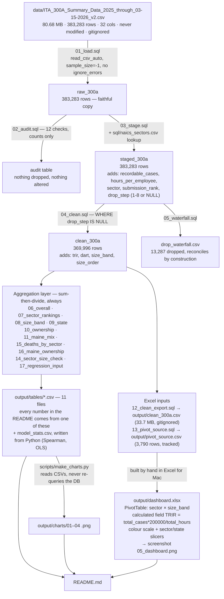

# Interview notes — Leading Indicator

Written from a fresh read of the finished repository: `README.md`, `PRD.md`, `PROJECT_BRIEF.md`,
`CLAUDE.md`, all 17 files in `sql/`, `notebooks/analysis.ipynb` with its committed outputs,
`scripts/make_charts.py`, `output/dashboard.xlsx`, and every CSV in `output/tables/`.
Everything below is what the repo actually contains. Where the README and the repo disagree,
that is called out in its own section rather than smoothed over.

---

## 1. Plain-English overview

This project takes one year of OSHA Form 300A summary submissions — 383,283 establishment
records for calendar year 2025, downloaded from the Injury Tracking Application — and asks
which kinds of US workplaces actually carry the highest injury rates, rather than which ones
report the most injuries. After eight sequential exclusion rules remove 13,287 rows (3.47%),
the remaining 369,996 establishments are aggregated into hours-normalised recordable-injury
rates (TRIR) by industry sector, establishment size band and state, always by summing cases
and hours and dividing once.

The conclusion is that normalising by hours reorders the answer: three of the top five sectors
by raw case count are replaced when the ranking switches to rate. Public Administration rises
from 7th by count to 1st by rate (5.615), Construction falls from 5th to 15th (1.565), and the
two rankings correlate only at Spearman rho = 0.716. Three secondary results sit alongside it:
smaller establishments report higher rates (4.166 under 20 employees vs 3.196 at 250+, and the
gradient survives holding sector constant in an OLS with a coefficient of −0.1752 but an R² of
only 0.015); ranking by death rate instead of injury rate reorders the sectors a third time
(Construction moves 15th → 2nd); and Maine's national-high rate of 6.242 is explained by
neither its industry mix (2.3% of the gap) nor its ownership mix (−0.6%), leaving state
differences in reporting practice as the untested remaining candidate.

---

## 2. Data flow



Two structural rules hold the whole thing together, and both are worth saying out loud in an
interview:

- **Charts read CSVs, not the database.** `make_charts.py` opens `output/tables/*.csv`. A chart
  therefore cannot disagree with the table behind it, and no chart can quietly re-derive a
  number with a different filter.
- **Every row is tagged with the first rule it fails**, so `raw = clean + Σ(dropped per step)`
  holds by construction rather than by luck. The notebook asserts it (`assert
  waterfall.rows_dropped.sum() == n_raw`).

---

## 3. One query lifecycle — a single row from CSV to a bar on chart 01

Tracing one real establishment record. Identifying columns are withheld here for the same
reason `12_clean_export.sql` drops `establishment_name` and `company_name`: OSHA does not
validate these submissions and nothing in this project names an employer.

**Stage 0 — the raw CSV line.** 32 comma-separated fields. The ones that matter:

| field | value |
|---|---|
| `state` | NM |
| `naics_code` / `naics_year` | 921190 / 2022 |
| `establishment_type` | 3 (local government) |
| `size` | 22 (OSHA's peak-headcount code, 100–249) |
| `annual_average_employees` | 213 |
| `total_hours_worked` | 620,256 |
| `no_injuries_illnesses` | 1 (had recordable cases) |
| `total_deaths` / `dafw` / `djtr` / `other` | 0 / 0 / 9 / 8 |
| `year_filing_for` | 2025 |

**Stage 1 — `01_load.sql` → `raw_300a`.** `read_csv_auto(..., sample_size=-1, header=true)`,
no `ignore_errors`. The scan of the whole file types `annual_average_employees` as BIGINT and
`total_hours_worked` as DOUBLE. Nothing about this row is altered; the table is a faithful copy.

**Stage 2 — `02_audit.sql`.** The row is tested against all 12 checks and fails none of them:
year is 2025, hours ≥ 1,000, employees > 0, NAICS is six digits with sector 92 in the lookup,
no case count is null or negative, 17 cases < 213 employees, `no_injuries_illnesses = 1` is
consistent with cases > 0, hours per employee is 2,912 (inside 100–5,000), and OSHA's `size`
code 22 agrees with the band its headcount implies. Nothing is dropped at this stage anyway —
M1 counts, M2 acts.

**Stage 3 — `03_stage.sql` → `staged_300a`.** Four derived columns are attached before any
filtering:

- `recordable_cases = 0 + 9 + 8 = 17` (deaths deliberately not in it — see decision D1)
- `hours_per_employee = 620,256 / 213 = 2,912.0`
- `sector` via `LEFT('921190', 2) = '92'` joined to `sql/naics_sectors.csv` → **Public
  Administration**
- `submission_rank = 1` from `ROW_NUMBER() OVER (PARTITION BY establishment_id,
  year_filing_for ORDER BY TRY_STRPTIME(created_timestamp,'%m/%d/%Y') DESC …)` — this row is
  the only filing for its establishment and year

Then the `CASE` ladder assigns `drop_step`. All eight conditions evaluate false in order, so
`drop_step = NULL`. **This is the exclusion tagging: the row is not deleted, it is labelled.**

**Stage 4 — `04_clean.sql` → `clean_300a`.** `WHERE drop_step IS NULL` admits the row, and
three more columns are computed:

- `trir = 17 * 200000.0 / 620256 = 5.4816`
- `dart = (0 + 9) * 200000.0 / 620256 = 2.9020`
- `size_band = '100-249'`, `size_order = 3` — derived from `annual_average_employees = 213`,
  not from OSHA's `size` code (they happen to agree here; for 8.8% of clean rows the OSHA code
  is the retired legacy 2 and cannot agree with anything)

**Stage 5 — `07_sector_rankings.sql`.** `GROUP BY sector`. The row's own 5.4816 is *never used*.
What travels into the aggregate is its numerator and its denominator separately: 17 cases into
a sector total of 53,883 (0.032% of them) and 620,256 hours into 1,919,417,696 (0.032% of
them). The sector rate is then computed once:

```
53,883 × 200,000 / 1,919,417,696 = 5.6145
```

The same query's window functions give Public Administration `rank_by_rate = 1` and
`rank_by_count = 7`. Notebook cell 28 writes the result to `output/tables/sector_by_rate.csv`.

**Stage 6 — `scripts/make_charts.py`.** Reads that CSV, drops any sector marked
`insufficient n` (none are at sector level), sorts by `rank_by_rate`, and draws horizontal
bars. Our row is now part of the **top bar of chart 01**, labelled
`5.61  (n=7,877)  ·  #7 by count`.

The same row also flows into the 100–249 band of `size_band.csv`, the NM line of
`state_all.csv`, the local-government line of `ownership_split.csv`, one cell of the
`Public Administration × 100-249 × NM` row of `pivot_source.csv` (and therefore of the Excel
pivot), and one observation in the OLS design matrix with `log(213) = 5.361`. It never appears
individually in any published output.

---

## 4. Design decisions, with the alternative that was rejected

### D1 — Recordable cases = `dafw + djtr + other`. Deaths excluded from the numerator.

`PROJECT_BRIEF.md` specifies `recordable cases = deaths + dafw + djtr + other`. The PRD
overrides it (§5, locked at the M1 checkpoint) because OSHA's own Total Case Rate is
(Field H + I + J) × 200,000 / hours — days-away, restricted/transfer, and other recordable
cases — and BLS follows the same convention of tracking fatalities separately.

**Rejected alternative:** the brief's deaths-inclusive numerator. It would have added 745 cases
to 1,352,105 — a 0.055% change, invisible in every chart — while making the headline figure
non-comparable to the published BLS SOII rate that Section 7 checks it against. The cost of
that choice is paid honestly: deaths are carried as their own column on every aggregate, and
`15_deaths_by_sector.sql` gives them their own analysis, which turns out to be one of the more
interesting results in the project (see Q5).

### D2 — Sum then divide, never average per-establishment rates.

Every aggregate in the repo is `SUM(recordable_cases) * 200000.0 / SUM(total_hours_worked)`,
and every aggregate row also carries `n_establishments`, `total_hours` and `total_cases` so the
exposure behind the rate is visible. `AVG(trir)` appears nowhere in `sql/`.

**Rejected alternative:** `AVG(trir)`, which is the natural thing to type and is wrong, because
it weights a 9-employee shop identically to a 123,000-employee health system. The clean table
contains both: its maximum single-row TRIR is 598.8 (3 cases on 1,002 hours) and its largest
row is 455 million hours with 4 cases. Averaging lets the first outvote the second.
Q3 below quantifies exactly what would break.

### D3 — Size bands derived from `annual_average_employees`, not OSHA's `size` code.

Four bands: Under 20 / 20–99 / 100–249 / 250+, computed in `04_clean.sql` from the headcount
column. OSHA's `size` is retained but only as a validation statistic — `08_size_band.sql`
reports agreement of 88.62% / 92.18% / 89.83% / 94.99% across the four bands, excluding legacy
rows.

**Reasoning:** `annual_average_employees` measures the same population the hours denominator
measures. OSHA's `size` is *peak* headcount during the year. Deriving the band from the average
makes numerator, denominator and grouping describe one thing.

**Rejected alternative:** use OSHA's `size` code, patching only the legacy rows. The M1 audit
killed it on the numbers: 33,123 raw rows (8.642%) still carry code 2 — the 20–249 band retired
in 2023 — which *overlaps* two current bands rather than sitting beside them, and of those,
roughly 3,076 average outside 20–249 altogether. Patching would have banded ~91% of rows by
peak headcount and ~9% by average: a hybrid definition that is hard to defend in one sentence.

### D4 — Hours-per-employee (M1 check 10) promoted from a reported flag to exclusion step 8.

The PRD's recommendation had checks 9–12 as flags only. Check 10 was moved into the exclusion
list, and it drops 3,853 rows — the second-largest step.

**Reasoning:** it is the only rule that catches the employee/hours concatenation corruption, and
it catches it in *both* directions. 81,170,689 employees against 170,689 hours ("81" + "170689")
gives 0.002 hours per employee; 4,883,821 against 83,821 gives 0.017. In the other direction sit
rows reporting 140,142,000,000 hours for 137 employees. Because aggregation sums hours before
dividing, **one** surviving 140-billion-hour row would have swamped its sector's denominator and
driven that sector's rate to nearly zero. The split is 1,262 rows below 100 hours/employee and
2,591 above 5,000.

**Rejected alternative:** flag and keep, per the PRD's default recommendation. A rate is only as
good as its denominator, and this is a denominator-integrity rule, not a data-taste rule.

### D5 — First-failure drop-step tagging instead of chained `WHERE NOT (...)` filters.

`03_stage.sql` writes a `CASE` ladder that returns the *first* step number a row fails, and
`04_clean.sql` is then simply `WHERE drop_step IS NULL`. Every one of the 383,283 rows carries
exactly one label, so the waterfall sums to the raw row count by construction and the notebook
asserts it.

**Reasoning:** the independent audit counts and the waterfall counts *must* differ, and the
design makes the difference explainable instead of embarrassing. M1 check 5 counts 4,471 rows
with zero/NULL employees, but waterfall step 4 drops only 221 — the rest were already taken by
step 3 (hours below 1,000). Check 10 counts 5,243; step 8 drops 3,853. Check 4 counts 9,049
hours-below-1,000 rows and check 3 counts 3 null-hours rows, but step 3 drops 9,046, because 6
of those rows are the corrupt tail records that step 1 removes first.

**Rejected alternative:** a sequence of filtered CTEs, or one big `WHERE`. Both give the same
clean table and neither can tell you what happened to a specific row. With overlapping rules,
"rows dropped per rule" then stops summing to the total, and the reconciliation becomes an
argument instead of an assertion.

### D6 — Establishments reporting zero recordable cases are kept.

160,275 of 369,996 clean rows — **43.32%** — reported zero recordable cases, and all of them
stay. `06_overall.sql` reports the count explicitly so the decision is visible rather than
implicit.

**Reasoning:** they worked hours. Those hours are real exposure and belong in every denominator.

**Rejected alternative:** filter to `no_injuries_illnesses = 1`, which is tempting because those
rows look empty. It would have inflated every rate in the project by roughly the ratio of total
hours to non-zero-establishment hours — a purely arithmetic increase describing nothing about
workplace safety. The same 43.32% is also the reason OLS is the wrong model class (D7 / Q8).

### D7 — DuckDB + SQL files over pandas alone.

Plain `.sql` files, one query per file, executed from the notebook through a nine-line `run()`
helper that substitutes `{CSV_PATH}` and `{SECTORS_PATH}` placeholders so no file carries a
machine-specific path. A persistent database at `data/leading_indicator.duckdb` (163 MB) means
the loaded table survives a kernel restart.

**Reasoning:** the aggregations here are exactly what SQL is for — `GROUP BY` with `RANK()
OVER`, and window functions computing both rankings in one query so they cannot drift apart.
The queries are also the artefact a reviewer reads: each file opens with a comment explaining
the judgement calls in it, which a chain of pandas `.groupby().agg()` calls does not naturally
carry. `read_csv_auto(sample_size=-1)` also typed all 32 columns from a full scan, which is how
the three VARCHAR count columns — and behind them the six corrupt tail rows — were found.

**Rejected alternative:** pandas end to end. It would work: 383,283 rows fits in memory. But the
rate logic would live inside Python expressions rather than in reviewable files, the placeholder
substitution trick that keeps paths out of the queries would have no purpose, and there would be
no persistent artefact to re-query between milestones. The regression is the one place pandas is
the right tool, so `17_regression_input.sql` selects only the six columns the model needs and
hands the frame to statsmodels.

*(A footnote on the stack: `CLAUDE.md` names duckdb, pandas, matplotlib, jupyter, statsmodels and
openpyxl. The notebook also imports `scipy.stats.spearmanr` directly. scipy is a hard dependency
of statsmodels and was already installed and pinned in `requirements.txt`, so nothing new was
added to the environment — but the import is worth knowing about before someone asks.)*

---

## 5. The numbers

**The one command that reproduces all of them:**

```bash
.venv/bin/jupyter nbconvert --to notebook --execute notebooks/analysis.ipynb --output /tmp/clean_run.ipynb
```

Verified in this session: **exit 0**, and it rewrote every CSV in `output/tables/` and every PNG
in `output/charts/` byte-for-byte identically to what is committed — with one exception worth
knowing before an interviewer finds it. `model_stats.csv` came back differing in the 13th
significant digit of the OLS coefficient (`-0.17515691989477292` committed vs
`-0.1751569198947767` on re-run). That is floating-point non-determinism in the underlying BLAS
least-squares solve, not a change in any result; every figure below is stable to far more
decimal places than anyone quotes. The file was restored with `git checkout` so the working tree
stays clean.

| figure | value | file |
|---|---|---|
| raw rows loaded | 383,283 | notebook cell 2 (CSV is 80.68 MB, gitignored) |
| rows excluded | 13,287 (3.47%) | `drop_waterfall.csv` |
| clean establishments | 369,996 | `overall.csv` |
| total hours worked | 77,817,253,795 | `overall.csv` |
| recordable cases | 1,352,105 | `overall.csv` |
| deaths (separate from TRIR) | 745 | `overall.csv` |
| **overall TRIR** | **3.475** | `overall.csv` |
| overall DART | 2.198 | `overall.csv` |
| zero-case establishments kept | 160,275 (43.32%) | `overall.csv` |
| top sector by rate | Public Administration, 5.615 (#7 by count) | `sector_by_rate.csv` |
| top sector by count | Health Care, 333,819 cases (#6 by rate) | `sector_by_count.csv` |
| largest fall | Construction, #5 by count → #15 by rate | `sector_by_rate.csv` |
| Spearman rho, the two rankings | 0.716 (p = 0.000387, n = 20) | `model_stats.csv` |
| size gradient | 4.166 / 3.932 / 3.809 / 3.196 | `size_band.csv` |
| OLS log-employees coefficient | −0.1752, 95% CI [−0.1976, −0.1527] | `model_stats.csv` |
| per doubling of size | −0.121 TRIR points (−3.49% of 3.475) | `model_stats.csv` |
| OLS R² / n | 0.0150 / 369,996 | `model_stats.csv` |
| sectors with Under-20 above 250+ | 16 of 20 (only 8 monotonic) | `model_stats.csv` |
| private / state govt / local govt | 3.453 / 2.742 / 5.293 | `ownership_split.csv` |
| government share of clean hours | 9.89% | `ownership_split.csv` |
| Maine | 6.242 on 1,843 establishments | `state_top10.csv` |
| Maine gap explained by industry mix | 2.3% (expected 3.538) | `maine_sector_mix.csv` |
| Maine gap explained by ownership mix | −0.6% (expected 3.458) | notebook cell 41 |
| Construction deaths / death rate | 180 / 2.176 per 100M hours (#2) | `deaths_by_sector.csv` |
| sectors too thin to rank on deaths | 7 of 20 (fewer than 10 deaths) | `deaths_by_sector.csv` |

**Other verifications run in this session**, all from `CLAUDE.md`'s checklist:
`git ls-files data/` is empty; nothing matching `.duckdb` or `.venv/` is tracked;
`git log --format='%an%n%s%n%b' | grep -i -E 'co-authored|claude'` returns nothing;
`output/dashboard.xlsx` contains one PivotTable (`PivotTable1`, rows = sector, columns =
size_band) whose calculated field reads literally `total_cases*200000/total_hours`, a colour
scale over the value block `B5:F24`, and two slicers (`Slicer_sector`, `Slicer_state`). Its cell
values match the SQL to full precision — Construction × Under 20 is 3.1139618992 in the workbook
and 3.1140 in `sector_size_check.csv`.

---

## 6. Where the README and the repo disagree

Three real mismatches, plus two things a careful reader will trip over.

1. **The Excel dashboard is described as a placeholder that is no longer missing.** The README's
   chart section still reads `> **[PLACEHOLDER]** output/charts/05_dashboard.png — … Drop the
   file in at that path and this image will render.` The file exists, is 458 KB, and was
   committed in `14e00be` ("m4: Excel dashboard and screenshot"). The image renders on GitHub
   today; only the placeholder note is stale. **Fix: delete the blockquote, keep the caption.**

2. **The README says four PNGs; there are five.** The repository listing at the bottom reads
   `output/charts/   the four PNGs`. There are five committed PNGs (01–04 plus the dashboard
   screenshot). The same listing omits `output/dashboard.xlsx`, `output/pivot_source.csv` and
   `docs/`, all of which are tracked.

3. **`PRD.md` §8 names SQL files that do not exist.** The M2 milestone lists `sql/03_clean.sql`,
   `04_drop_waterfall.sql`, `05_sector.sql`, `06_size_band.sql`, `07_state.sql`. The repo has
   `03_stage.sql`, `04_clean.sql`, `05_waterfall.sql`, `06_overall.sql`, `07_sector_rankings.sql`,
   `08_size_band.sql`, `09_state.sql` — the staging step was inserted at 03 and everything after
   it shifted. PRD §7 was updated to the real names; §8 was not. The README does not name SQL
   files, so it is not affected.

4. **Two different legacy-`size` counts are both correct and easy to conflate.** The README's
   validation section cites "33,123 rows (8.6%) still carry the legacy code 2" — that is the
   count in the *raw* file (8.642% of 383,283), which is the right number for justifying why the
   bands were derived. The notebook separately reports 32,681 (8.83%) surviving into the *clean*
   table. Neither is wrong; the README's "still carry" phrasing sits beside clean-table
   statistics and invites the wrong reading.

5. **The committed notebook shows four charts; a re-run shows five.** Cell 47 displays every PNG
   via `sorted((OUTPUT_DIR/"charts").glob("*.png"))`. The committed outputs predate the Excel
   screenshot, so they list four files. Re-running today embeds the screenshot as a fifth image.
   Harmless, but the notebook and the chart directory are one commit out of step.

Two non-issues that look like issues and are not: the README's "3.47%" is 13,287/383,283 =
3.466% rounded, and its `How to run` block runs `make_charts.py` after the notebook even though
cell 47 already runs it as a subprocess — redundant, not wrong.

---

## 7. Ten questions, with answers this repo can actually support

**Q1. Why not just rank sectors by injury count? Isn't that the real number of people hurt?**

It is, and that is a different question. A count answers "where do the most injuries happen",
which is mostly a question about where the most people work. Health Care records 333,819
recordable cases — the most of any sector — because it works 1.55 × 10¹⁰ hours, the second-most
of any sector; its rate, 4.294, is only 6th. Arts, Entertainment and Recreation works 9.93 × 10⁸
hours, about an eighteenth of Manufacturing's, so it never appears near the top of a count list
despite a rate (4.587) nearly twice Manufacturing's (2.542). The count ranking is the right tool
for allocating a fixed number of inspectors; the rate ranking is the right tool for asking where
an individual hour of work is most likely to end in a recordable injury. This project reports
both, from a single query so they cannot drift, and the gap between them is the finding: three
of the top five change, and Spearman rho is 0.716, not 1.0.

**Q2. Why 200,000?**

It is 100 employees × 40 hours × 50 weeks — one hundred full-time worker-years. It makes the
rate read as "recordable cases per 100 full-time workers per year", which is the unit OSHA and
BLS publish in, so 3.475 can be set beside BLS's 2.3 without conversion. Nothing statistical
depends on it: it is a scaling constant, and using 1,000,000 hours or 1 hour would preserve every
ranking in the project. It matters for comparability, not for correctness. (The one place the
repo departs from it is `15_deaths_by_sector.sql`, which uses 100 million hours, because 745
deaths on a 200,000-hour base gives numbers like 0.0019 that no one can read.)

**Q3. What would actually break if you averaged the per-establishment rates instead?**

The headline finding would invert. Computed ad hoc for these notes — this is *not* in the
pipeline or in `output/tables/`, precisely because the project's rule is never to compute it —
`AVG(trir)` gives an overall figure of **4.276** against the correct **3.475**, and it reorders
the sectors:

| sector | rank, sum-then-divide | rank, average of rates |
|---|---|---|
| Public Administration | **1** | 5 |
| Transportation and Warehousing | 2 | **1** |
| Other Services | 13 | **6** |
| Real Estate and Rental and Leasing | 9 | **4** |
| Educational Services | 10 | **7** |

Public Administration — the entire top line of the README — falls to 5th. The mechanism is that
an average of rates is a headcount-weighted vote of establishments, not an hours-weighted
measure of exposure. Small establishments are numerous (99,492 of 369,996 are under 20
employees) and their rates are volatile, because a rate built on 1,000 hours moves by 20 points
with a single case. The clean table's maximum single-row TRIR is 598.8 — 3 cases on 1,002 hours.
Under an average, that establishment counts as much as one working 455 million hours. Sum-then-
divide is not a stylistic preference; it is the difference between measuring exposure and
polling establishments.

**Q4. Your rate is 3.475 and BLS reports 2.3. Which one is wrong?**

Neither. They measure different populations, and the direction of the gap is the direction you
would predict. Three reasons, in order of how much each explains:

1. *Reporting thresholds.* The ITA file only contains establishments required to file —
   250+ employees outside partially-exempt industries, plus 20–249-employee establishments in
   *designated high-hazard* industries. The sample is skewed toward large and high-hazard
   workplaces by construction. This is the bulk of the 1.18-point gap.
2. *Census of filers vs probability sample.* SOII is a weighted probability sample designed to
   generalise to the private-sector population. This is a census of who had to file, plus
   voluntary submissions OSHA kept. It was never built to estimate a national rate.
3. *Government inclusion — and this is the one to be careful with.* BLS's private-industry
   figure excludes government; this file includes it. That sounds like a good explanation and it
   is almost entirely wrong: government is 9.89% of clean hours, and removing it moves the rate
   from 3.475 to **3.453** — about 0.02 of a 1.18-point gap. The two levels pull in opposite
   directions, with local government at 5.293 but state government at 2.742, *below* private
   industry's 3.453.

The benchmark is also one year behind: CY2024 SOII (news release USDL-26-0101, 22 January 2026)
against CY2025 ITA data, because CY2025 SOII estimates are not published until 18 November 2026.

**Q5. Construction is 15th by injury rate and 2nd by death rate. How do you explain that?**

By not treating TRIR as a severity measure. TRIR counts recordable cases and weights a stitched
finger the same as a fall from height, and under the OSHA Total Case Rate definition used here
it excludes deaths from the numerator entirely. Ranking the same 20 sectors by deaths per 100
million hours moves Construction from 15th (1.565 TRIR) to 2nd (2.176), a 13-place jump on 180
deaths — the largest death count in the file. The reverse is just as sharp: Health Care has the
most recordable cases of any sector and the third-*lowest* death rate (0.244), and Retail Trade
moves 4th → 14th. Sectors that hurt a lot of people and sectors that kill people are not the
same set.

The bounds travel with the claim. 745 deaths across 20 sectors is thin: only 13 sectors clear 10
deaths and the other 7 are explicitly marked "too thin to rank" in `deaths_by_sector.csv`.
Finance and Insurance shows zero deaths across 833 establishments, which means no death appears
in this file, not that finance is safe. And OSHA ITA 300A is not the authoritative source for
workplace fatalities — BLS's Census of Fatal Occupational Injuries is, built from death
certificates and coroner records for exactly this purpose. The defensible claim is the ordering
of the well-populated sectors, not any individual death rate.

**Q6. Maine's rate is 6.242, the highest in the country. What does that show?**

It shows that two composition explanations fail, and nothing more.

*Industry mix:* give Maine its own hours mix but the national rate for each sector, and its
expected rate is 3.538, against a national 3.475 and an actual 6.242 — **2.3%** of the
2.767-point gap. *Ownership mix:* the same standardisation on `establishment_type` gives 3.458,
which is **−0.6%** — nothing, in the wrong direction. Ownership fails for a specific and
checkable reason: Maine is *less* government-heavy than the country (96.65% of its hours private
vs 89.87% nationally), and since local government carries the highest national rate, its mix
should pull Maine's number *down*.

What is left is uniform within-group elevation: private 6.160 vs 3.453, state government 8.270
vs 2.742, local government 9.385 vs 5.293, Health Care 7.607 vs 4.294, Manufacturing 5.077 vs
2.542, Retail Trade 6.925 vs 4.502. A factor of roughly 1.5×–3× inside every sector and every
ownership category is not a composition effect.

What it does **not** show is that Maine is more dangerous. The remaining candidate is difference
in reporting practice and completeness between states, and this dataset cannot distinguish "more
injuries occur in Maine" from "more injuries are recorded and submitted in Maine". Testing that
needs something outside this file — state plan status, BLS SOII state estimates, workers'
compensation claims — and the README, the notebook and the chart 04 caption all say so rather
than implying a safety ranking.

**Q7. Nearly half your establishments reported no injuries at all. Why keep them?**

Because they worked hours, and hours are the denominator. 160,275 of 369,996 clean rows (43.32%)
reported zero recordable cases. Dropping them would remove real exposure from every denominator
while removing no cases from any numerator, so every rate in the project would rise —
mechanically, describing nothing about workplace safety. The temptation is real because those
rows look empty in a spreadsheet, which is exactly why `06_overall.sql` reports the count as a
named column: the decision is visible in the output rather than hidden in a `WHERE` clause.
Their one genuine cost is statistical, not arithmetic: that 43.32% point mass at zero is what
makes OLS the wrong model class (Q8).

**Q8. What would a Poisson model with a `log(hours)` offset fix?**

Four things the OLS gets wrong by construction:

- *The floor.* TRIR cannot be negative, and 43.32% of observations sit exactly on zero. OLS
  assumes an unbounded, roughly symmetric error, so the fitted line can predict negative rates
  and the residuals cannot possibly be normal.
- *The zeros.* OLS treats a zero-case establishment as an extreme low value of a continuous
  variable. A count model treats it as what it is — a count of zero, entirely expected when the
  expected count is small.
- *The variance.* A rate built on few hours is noisier than one built on many. Poisson variance
  scales with the mean, which is roughly the right shape; OLS assumes constant variance, so the
  Under-20 band violates the assumption most severely of all.
- *The exposure.* `recordable_cases ~ … + offset(log(total_hours_worked))` models what was
  actually observed (a count) against what generated it (hours), instead of modelling a ratio
  and then hoping the denominator does not matter.

In practice negative binomial rather than plain Poisson, because these counts will be
overdispersed. What it would probably *not* change is the sign of the size effect — the
descriptive gradient (4.166 → 3.196) and the OLS coefficient (−0.1752, CI [−0.1976, −0.1527])
agree with each other, and both agree with the 16-of-20 sector-level count. It was not fitted
here for reasons of time and scope, that is stated in the notebook and the README rather than
hidden, and it is the first item under next steps.

**Q9. Your R² is 0.015. Why report the model at all?**

Because R² and the coefficient answer different questions, and only one of them was asked. The
question the aggregates raised was: is the size gradient just sector mix, if small
establishments cluster in high-rate sectors? `C(sector)` holds sector constant, and the
coefficient stays at −0.1752 with a 95% CI of [−0.1976, −0.1527] that excludes zero
comfortably — so no, the gradient is not merely a composition artefact. That is a claim about
the *population average*, and the model supports it.

What the model does not support is prediction. R² = 0.0150 means size and sector together
explain 1.5% of the variance in an individual establishment's rate, so this cannot tell you
anything useful about a particular workplace. The precision comes from n = 369,996, not from
strength: at that sample size a trivial effect clears any significance threshold, and quoting
p = 6.5 × 10⁻⁵³ as though it were evidence of importance would be the mistake. The sector-level
check makes the same point without any statistics: 16 of 20 sectors have a higher rate in the
Under-20 band than at 250+, but only 8 fall monotonically across all four bands, and four run
the other way entirely — Public Administration *rises* 1.88 points from Under-20 to 250+. The
gradient is a tendency, not a rule, and the README says so in the same paragraph as the
coefficient.

**Q10. You dropped 13,287 rows. How do I know you didn't drop the interesting ones?**

Three ways, all of them checkable in the repo.

First, the accounting is complete. Every raw row carries exactly one `drop_step`, so
`raw = clean + Σ dropped` holds by construction and the notebook asserts it —
383,283 = 369,996 + 13,287. Nothing vanishes silently: the loader runs without
`ignore_errors`, so a row that will not parse raises rather than disappearing.

Second, the reasons are boring and inspectable. 9,046 rows have hours below 1,000 or missing;
3,853 have an impossible hours-per-employee ratio; 221 have no employees; 146 report more
recordable cases than employees; 15 have an unusable NAICS code; 6 are the corrupt tail records.
Notebook cell 24 prints the two most extreme rows removed by every step, so you can look at what
went and judge for yourself. The largest single step (step 3) is dominated by establishments with
implausibly small hours, whose TRIR would be absurd in either direction.

Third, two steps drop nothing, and that is deliberate evidence rather than dead code. Step 2
(duplicate submissions) drops 0, because the only repeated `establishment_id` in the file is the
literal string `"TX"` — a state code shifted into the id column on corrupt rows that step 1
removes first. There are no genuine duplicate establishments in 383,283 rows. Step 6 (null or
negative case counts) also drops 0. A waterfall line reading "0" is better evidence than a
missing rule: it shows the problem was considered and measured, and the PRD instructs stopping
and reporting if step 2 ever stops being 0 on another year's file.

The honest caveat: 3.47% is the fraction dropped, and the exclusions are *ratio*-based, not
level-based. A row reporting 455 million hours for 123,461 employees passes every check
(3,689 hours per employee is plausible) and contributes 2.93% of Health Care's total hours on 4
recordable cases. Removing it would move Health Care from 4.294 to 4.424. Nothing here validates
that any surviving row is *true* — OSHA does not validate these submissions either.

---

## 8. Glossary

| term | one line |
|---|---|
| **TRIR** | Total Recordable Incident Rate: recordable cases × 200,000 ÷ hours worked, i.e. cases per 100 full-time workers per year. The metric this whole project is built on. |
| **DART** | Days Away, Restricted, or Transferred rate: the same formula counting only `dafw + djtr` cases. A crude severity filter — it drops the "other recordable" cases. Computed on every table here (overall 2.198) but not charted. |
| **NAICS** | North American Industry Classification System. A six-digit industry code; its first two digits give the 20 sectors used throughout, via `sql/naics_sectors.csv` (31–33 collapse to Manufacturing, 44–45 to Retail Trade, 48–49 to Transportation and Warehousing). |
| **recordable case** | A work-related injury or illness that OSHA requires to be logged: death, days away from work, restricted work or job transfer, medical treatment beyond first aid, loss of consciousness, or a significant diagnosis. Here the numerator is `dafw + djtr + other` — OSHA's Total Case Rate — with deaths carried separately. |
| **Form 300A** | The annual summary an employer posts and files: one row of totals per establishment per year. Not the incident-level 300/301 logs, which are out of scope. |
| **ITA** | Injury Tracking Application — OSHA's electronic submission portal, and the public file this analysis reads. Self-reported, not validated by OSHA. |
| **SOII** | BLS Survey of Occupational Injuries and Illnesses — a weighted probability sample designed to estimate national injury rates. The benchmark our 3.475 is checked against (private industry, CY2024: 2.3). |
| **CFOI** | BLS Census of Fatal Occupational Injuries — the authoritative US count of workplace deaths, built from death certificates and coroner records. Cite it for fatalities, not the 745 deaths in this file. |
| **establishment** | One physical location where business is conducted — not a company. A firm with 40 warehouses files 40 Form 300As. This is why the analysis never rolls up to employer level. |
| **sum-then-divide** | Aggregate a rate as `SUM(cases) × 200,000 ÷ SUM(hours)`: sum both parts, divide once. The alternative — averaging per-establishment rates — weights a 9-person shop like a 123,000-person system and reorders the results (Q3). |
| **Spearman correlation** | Correlation of *ranks* rather than values; 1.0 means two orderings are identical. Used here to summarise how much the rate ranking differs from the count ranking across 20 sectors: rho = 0.716. |
| **OLS** | Ordinary least squares — fits a straight line by minimising squared residuals. Used once, `trir ~ log(employees) + C(sector)`, to test whether the size gradient survives holding sector constant. Assumes unbounded symmetric errors, which a rate with 43% zeros does not have. |

---

## 9. Known limitations, and what I would do next

### Limitations, in rough order of how much they constrain the claims

1. **Not a national rate, and not generalisable.** The file covers only establishments required
   to file — 250+ employees outside partially-exempt industries, plus 20–249-employee
   establishments in designated high-hazard industries — plus voluntary submissions OSHA kept.
   Every figure here describes *reporting establishments*, which is why the wording throughout
   is "highest recordable-injury rate among reporting establishments".
2. **Self-reported and unvalidated.** OSHA does not verify submitted counts and states that
   ranking establishments as most or least dangerous from these rates would be inappropriate.
   Hence: nothing in the repo ranks below sector, size band or state level, and neither
   `pivot_source.csv` nor `clean_300a.csv` carries `establishment_name` or `company_name`.
3. **One year, and a partial snapshot of it** — CY2025 injuries, submissions received only
   through 15 March 2026. Late filers are missing, and one year is not a trend.
4. **Rate ≠ severity.** TRIR weights every recordable case equally and excludes deaths. Section 9
   of the notebook shows how much that matters: the death-rate ranking is a different ordering
   entirely, on 745 deaths that are themselves too thin for 7 of the 20 sectors.
5. **The Under-20 band is not a clean read on small workplaces.** It mixes genuinely small
   establishments — largely exempt from routine reporting, so self-selected toward high-hazard
   industries — with seasonal establishments whose peak headcount is far above their annual
   average. The chart 03 caption says this; it is the weakest of the three size comparisons.
6. **Three NAICS vintages coexist** — 2022 (60.4%), 2012 (36.4%), 2017 (3.2%), plus 167 rows
   coded `naics_year = 0`. Safe at the two-digit sector level, where the 20 sectors are stable
   across all three; this analysis would not be safe at 4–6 digit detail.
7. **Exclusions are ratio-based, not level-based.** A row can report 455 million hours and pass
   every check as long as its hours-per-employee ratio is plausible. Single large rows can move
   a sector rate by around 0.1 (Q10).
8. **131 clean rows still contradict themselves** on `no_injuries_illnesses` versus their case
   counts (M1 check 9, flagged rather than excluded, 135 in the raw file). Small, but a reminder
   that passing the exclusion rules is not the same as being correct.
9. **The OLS is a first approximation**, for all the reasons in Q8, and its R² of 0.015 is
   reported in the README's own headline rather than a footnote.

### What I would do next, in the order I would do it

1. **Fit the negative-binomial count model**: `recordable_cases ~ log(employees) + C(sector) +
   offset(log(total_hours_worked))`, and compare its size coefficient to the OLS one. This is
   the single change that most improves the statistical honesty of the size claim.
2. **Add years.** The pipeline is already parameterised on one path and one `year_filing_for`
   filter, and step 2's de-duplication rule exists precisely so it survives a multi-year file. A
   run over 2019–2025 would say whether Public Administration's top rank and the size gradient
   are stable or one-year noise — and would let the Maine question be asked as "is Maine high
   *every* year", which is a much stronger test than one cross-section.
3. **Attack the Maine reporting hypothesis with outside data.** Compare state-plan versus federal
   OSHA jurisdiction, BLS SOII state estimates, and per-state filing counts against covered
   employment. If Maine's *filing rate* is unusually complete, that is a measurable explanation
   for a reporting artefact rather than a hand-wave.
4. **Report a confidence interval on every group rate.** A Poisson interval on the case count
   would make the "insufficient n" rule quantitative instead of a flat n ≥ 30 threshold, and it
   would show honestly that Mining's 0.688 on 829 establishments is far less certain than
   Manufacturing's 2.542 on 58,329.
5. **Fix the five README/repo mismatches in section 6** — half an hour of work, and every one of
   them is the kind of thing a reviewer notices first.
